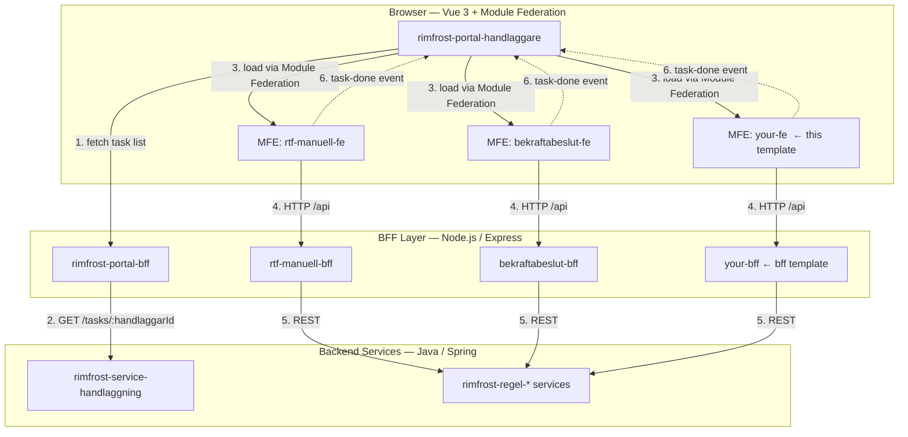

# Rimfrost Micro Frontend Template

A template project for creating micro frontends in the Rimfrost task management system using Vue 3, TypeScript, and Module Federation.

## Table of Contents

- [Overview](#overview)
- [Architecture](#architecture)
- [Getting Started](#getting-started)
- [Project Structure](#project-structure)
- [Module Federation Setup](#module-federation-setup)
- [Development](#development)
- [Building & Deployment](#building--deployment)
- [Best Practices](#best-practices)
- [Integration with Host](#integration-with-host)

## Overview

This template is designed to help you quickly create micro frontends for Rimfrost's task management system. A micro frontend (or remote app) is a specialized Vue application that:

- Handles a specific type of operational task
- Is loaded dynamically by the host frontend based on task configuration
- Communicates with a dedicated Backend-for-Frontend (BFF) service
- Manages its own state and components using Pinia and Vue Router

### Key Features

- ✅ **Module Federation** - Dynamically loadable as a remote component
- ✅ **TypeScript** - Full type safety for development
- ✅ **Pinia State Management** - Reactive state management for component data
- ✅ **FKUI Components** - Försäkringskassan's design system integration
- ✅ **Hot Module Replacement** - Fast development feedback
- ✅ **BFF Integration** - Ready to communicate with a dedicated backend service

## Architecture

### Platform Architecture

The Rimfrost platform is built around a **host + remotes** micro-frontend model. The portal acts as the shell — it authenticates the user, fetches the task queue, and dynamically loads the right micro frontend for whichever task the user picks. Each micro frontend ships alongside its own dedicated BFF, making each task type independently deployable and maintainable.



#### How a task flows through the system

1. **Portal fetches the task queue** — on startup the portal calls the Portal BFF, which retrieves the handläggare's task list from `rimfrost-service-handlaggning`.
2. **Handläggare picks a task** — the task object carries a `url` field that identifies which micro frontend should handle it.
3. **MFE loaded at runtime** — the portal fetches the remote registry from Portal BFF (`GET /api/route-manifest`) and looks up `task.url` to get the remote entry URL, then imports the component via Module Federation. The portal passes `handlaggningId` (and optionally `regeltyp`) as props when it mounts the component. No page navigation happens — the MFE renders inside the portal shell.
4. **MFE fetches its own data** — the component calls its dedicated BFF to retrieve the task-specific data it needs.
5. **BFF calls the backend** — the BFF transforms the request, applies business logic, and forwards it to the relevant `rimfrost-regel-*` service.
6. **Task completed** — when the user submits, the MFE dispatches a `task-done` custom event via `window.dispatchEvent`. The portal catches this, shows a toast notification, and refreshes the task queue.

#### How the route manifest connects everything

`remotes.json` in `rimfrost-portal-bff` (or the Kubernetes ConfigMap it points to) is the only place that needs to know about a micro frontend. It maps a task's `url` value to a Module Federation remote entry. The portal fetches this registry from the BFF at runtime — no rebuild of the portal is required when you add or change an entry.

```
remotes.json (in rimfrost-portal-bff)
├── rtf-manuell      → rimfrost-regel-rtf-manuell-fe    + rimfrost-regel-rtf-manuell-bff
├── bekraftabeslut   → rimfrost-regel-bekraftabeslut-fe  + rimfrost-regel-bekraftabeslut-bff
└── your-regel       → rimfrost-template-micro-fe        + rimfrost-template-micro-fe-bff
                                          ↑ this template
```

The portal discovers your MFE solely through this registry entry — everything else is loaded at runtime.

#### Why a separate BFF per micro frontend?

- **Isolation** — a breaking change in one regel's backend contract does not affect other MFEs
- **Right-sized API** — each BFF exposes only the endpoints its own MFE needs
- **Independent deployment** — MFE and BFF pairs can be released on their own schedule
- **Dev ergonomics** — start only the BFF you are actively working on; mock-data fallback keeps the rest available locally

---

### How Micro Frontends Fit In

The Rimfrost system uses a **micro-frontend architecture** where the host application dynamically loads remote applications based on user selections.

```
┌─────────────────────────────────────────────────────┐
│  Host Frontend (Portal)                             │
│  - Displays task list                               │
│  - Loads micro frontends dynamically                │
│  - Routes between different micro frontend types    │
└────────┬────────────────────────────────────────────┘
         │
         └─ Loads via Module Federation when user
            selects a task of your type
         │
    ┌────▼──────────────────────────────────────────┐
    │  Your Micro Frontend (This Template)           │
    │  - Displays task-specific UI                   │
    │  - Manages task state                          │
    │  - Communicates with dedicated BFF             │
    └────┬───────────────────────────────────────────┘
         │
         └─ HTTP requests to...
         │
    ┌────▼──────────────────────────────────────────┐
    │  Your Micro Frontend BFF                       │
    │  - Data transformation                         │
    │  - Backend communication                       │
    │  - Mock data fallback (development)            │
    └────┬───────────────────────────────────────────┘
         │
         └─ HTTP requests to...
         │
    ┌────▼──────────────────────────────────────────┐
    │  Backend API Services                          │
    │  - Business logic                              │
    │  - Data persistence                            │
    └──────────────────────────────────────────────┘
```

### Data Flow

1. **Host loads your component**: User selects a task, host dynamically imports your component via Module Federation
2. **Component receives props**: Your component receives `handlaggningId` (customer flow ID) and other task context
3. **Component fetches data**: Calls your BFF endpoint with the task ID
4. **BFF communicates**: Your BFF handles backend communication, error handling, and mock data fallback
5. **Component displays UI**: Renders the task-specific interface using received data

## Getting Started

### Prerequisites

- Node.js 18+ (recommended version 24)
- npm or yarn for package management
- A running instance of your micro frontend BFF on port 9002 (default, configurable)

### Installation

1. Clone this template (or create a new repository from it)
   ```bash
   git clone <your-template-repo-url>
   cd your-micro-frontend
   ```

2. Install dependencies
   ```bash
   npm install
   ```

3. Create a `.env` file (optional, for custom BFF URL)
   ```env
   VITE_BFF_URL=http://localhost:9002
   VITE_PORT=3033
   ```

### Development

Start the development server:
```bash
npm run dev
```

The micro frontend will be available at `http://localhost:3033`.

In development, you can:
- **Test standalone**: Access the app directly in your browser
- **Test with host**: The host frontend will load this micro frontend when configured

### Building

Build for production:
```bash
npm run build
```

This creates optimized, bundled files ready for deployment.

### Preview

Preview the built application locally:
```bash
npm run preview
```

## Project Structure

```
src/
├── App.vue                      # Root component (received from host props)
├── main.ts                      # Application entry point
├── main.scss                    # Global styles
├── style.css                    # Additional global styles
├── components/
│   └── ExampleComponent.vue     # Your task-specific components go here
├── stores/
│   └── ExampleStore.ts          # Pinia stores for state management
└── types.ts                     # TypeScript type definitions
```

### Key Files Explained

**App.vue** - Root component that receives props from the host:
```vue
<script setup lang="ts">
const props = defineProps<{
  handlaggningId: string;  // Customer flow ID from task
  regeltyp?: string;           // Rule type (optional)
}>();
</script>
```

**ExampleComponent.vue** - Your main component for the task UI. This demonstrates:
- Using Pinia stores for state management
- Fetching data from your BFF
- Displaying data and handling user interactions
- Handling errors gracefully

**ExampleStore.ts** - Pinia store pattern:
```typescript
import { defineStore } from "pinia";

export const useExampleStore = defineStore("example", {
  state: () => ({
    // Your reactive data here
    taskData: null,
    loading: false,
    error: '',
  }),
  actions: {
    // Your async actions here
    async fetchTaskData(id: string) {
      // Call your BFF
    }
  }
});
```

## Module Federation Setup

### How It Works

Your micro frontend exports components and stores via **Module Federation**, making them accessible to the host frontend.

The configuration in `vite.config.ts`:

```typescript
federation({
  name: "remoteApp",              // Unique name for your micro frontend
  filename: "remoteEntry.js",     // Entry point file
  exposes: {
    "./ExampleComponent": "./src/components/ExampleComponent.vue",
  },
  manifest: true,                 // Generates mf-manifest.json for runtime loading
  publicPath: "auto",             // Resolves asset URLs relative to mf-manifest.json
  shared: {
    vue: { singleton: true, requiredVersion: "^3.5.0" },
    "@fkui/vue": { singleton: true, requiredVersion: "^6.0.0" },
    pinia: { singleton: true, requiredVersion: "^3.0.0" },
  },
}),
```

### Exposing Your Components

To expose a component for the host to use:

1. **Create or update a component** - e.g., `src/components/MyTaskComponent.vue`

2. **Add to `exposes` in vite.config.ts**:
   ```typescript
   federation({
     exposes: {
       "./MyTaskComponent": "./src/components/MyTaskComponent.vue",
       "./AnotherComponent": "./src/components/AnotherComponent.vue",
     },
     // ...
   }),
   ```

3. **Host can then import** - The host frontend loads your component:
   ```javascript
   const MyComponent = React.lazy(() => 
     import("remoteApp/MyTaskComponent")
   );
   ```

### Shared Dependencies

Libraries listed under `shared` are shared between the host and your micro frontend. This reduces bundle size and prevents duplicate instances:

```typescript
shared: {
  vue: { singleton: true, requiredVersion: "^3.5.0" },
  "@fkui/vue": { singleton: true, requiredVersion: "^6.0.0" },
  pinia: { singleton: true, requiredVersion: "^3.0.0" },
}
```

`singleton: true` ensures only one instance is loaded even if both host and remote declare the same dependency. **Always add major dependencies used in exposed components to the `shared` object.**

## Development

### Developing Components

1. **Create components in `src/components/`**:
   ```bash
   # Create MyTaskComponent.vue
   ```

2. **Create Pinia stores in `src/stores/`**:
   ```typescript
   import { defineStore } from "pinia";
   
   export const useMyStore = defineStore("myStore", {
     state: () => ({ /* ... */ }),
     actions: { /* ... */ }
   });
   ```

3. **Use components in App.vue or other components**:
   ```vue
   <MyTaskComponent :handlaggningId="props.handlaggningId" />
   ```

### Fetching Data from BFF

The BFF URL is read from `src/config/env.ts`, which checks `window._env_` first (container) and falls back to `VITE_BFF_URL` (local dev):

```typescript
import { env } from '../config/env';

const response = await fetch(`${env.bffUrl}/api/regel/your-endpoint`);
```

### Best Practices for Components

1. **Use scoped styles** - Prevent styles from affecting the host or other components:
   ```vue
   <style scoped>
   .local-class { /* Only applies within this component */ }
   </style>
   ```

2. **Keep components focused** - Each component should handle one task type or concern

3. **Use TypeScript interfaces** - Define data structures clearly:
   ```typescript
   interface TaskData {
     id: string;
     title: string;
     status: 'pending' | 'completed';
   }
   ```

4. **Handle errors gracefully** - Always catch and display errors to users

5. **Use FKUI components** - Maintain consistency with Försäkringskassan's design system

## Building & Deployment

### Build Process

```bash
npm run build
```

This:
- Compiles TypeScript
- Bundles the application with Module Federation
- Creates optimized CSS files
- Outputs to `dist/` directory

### Deployment

Your micro frontend can be deployed to:
- **Static file servers** (Nginx, Apache, etc.)
- **CDN** (CloudFront, Akamai, etc.)
- **Container services** (Docker, Kubernetes, etc.)

The key requirement is that `mf-manifest.json` (and the assets it references) are accessible at the URL configured in the host's `route-manifest.json`.

### Environment Configuration

Config is split between local development and container deployments. See the [Environment Variables](#environment-variables) section at the bottom for the full reference.

- **Local dev**: `VITE_*` values in `.env` are read by Vite at dev-server startup and baked into the bundle
- **Containers**: a `runtime-config.js` file is mounted into the container and read by the browser at page load — no rebuild needed

## Best Practices

### 1. Component State Management

- ✅ Use Pinia for shared component state
- ✅ Keep stores focused on a single responsibility
- ❌ Don't pass too much data as props (use stores instead)

### 2. Error Handling

- ✅ Always wrap async operations in try-catch
- ✅ Display user-friendly error messages
- ✅ Log errors for debugging (but not sensitive data)
- ✅ Fallback gracefully when BFF is unavailable

### 3. Performance

- ✅ Use dynamic imports for heavy components
- ✅ Minimize bundle size by removing unused dependencies
- ✅ Lazy load components only when needed

### 4. Security

- ✅ Validate all data from BFF before using
- ✅ Use environment variables for sensitive URLs (not hardcoded)
- ✅ Follow CORS best practices with your BFF

### 5. Code Organization

- ✅ Group related components in subdirectories
- ✅ Keep store logic separate from UI logic
- ✅ Share common utilities in a `composables/` or `utils/` folder

## Integration with Host

### Steps for Host to Load Your Micro Frontend

1. **Add an entry to `remotes.json` in `rimfrost-portal-bff`**:
   ```json
   {
     "routes": {
       "your-route-key": {
         "scope": "yourRemoteApp",
         "module": "YourMainComponent",
         "devEntry": "http://localhost:YOUR_PORT/mf-manifest.json",
         "prodEntry": "https://yourdomain.com/mf-manifest.json"
       }
     }
   }
   ```
   This is the **only** change needed to register your micro frontend — no rebuild of the portal or BFF is required. In production, `remotes.json` is a Kubernetes ConfigMap that can be updated live.

2. **Task data includes your route key**:
   ```json
   {
     "id": "task-123",
     "title": "Task Title",
     "url": "your-route-key",
     "handlaggningId": "flow-456",
     "regeltyp": "your-rule-type"
   }
   ```

3. **Host loads your component dynamically**:
   ```typescript
   const remoteComponent = await loadRemoteModule(task.url);
   // Host renders: <remoteComponent :handlaggningId="task.handlaggningId" />
   ```

### Communication between Host and Micro Frontend

**Props (from host to micro frontend)**:
- `handlaggningId` - The customer flow ID for the task
- `regeltyp` - The rule type (from task data)
- Any other custom props the host decides to pass

**Shared State via Pinia**:
If needed, your micro frontend can access the host's Pinia stores (since Pinia is shared in Module Federation).

## Troubleshooting

### BFF Connection Issues

**Problem**: Getting 404 or connection refused errors
- Check that your BFF is running on the configured port
- Verify `VITE_BFF_URL` environment variable is correct
- Check CORS headers in your BFF

### Module Federation Not Loading

**Problem**: `mf-manifest.json` not accessible
- In dev: ensure the remote dev server is running (`npm run dev`) — no build needed
- Verify the URL in `route-manifest.json` matches the remote's host and port
- In production: check that the deployed `mf-manifest.json` is publicly accessible at the configured `prodEntry` URL

### Styles Not Applying

**Problem**: Component styles not visible
- Use `scoped` styles in components
- Check for CSS specificity issues
- Verify FKUI styles are properly imported

### Store Not Persisting State

**Problem**: Pinia store loses data
- Ensure store is used with `<script setup>` - `const store = useMyStore()`
- Avoid recreating stores in effects

## Resources

- [Module Federation Documentation](https://module-federation.io/)
- [Vue 3 Documentation](https://vuejs.org/)
- [Pinia Documentation](https://pinia.vuejs.org/)
- [FKUI Vue Component Library](https://fkui.nu/)
- [Vite Documentation](https://vitejs.dev/)

## Example: Creating Your First Task Component

Here's a minimal example to get you started:

1. **Create `src/components/MyTaskComponent.vue`**:
   ```vue
   <script setup lang="ts">
   import { ref, onMounted } from 'vue';
   import { FButton, FInput } from '@fkui/vue';
   import { env } from '../config/env';
   
   const props = defineProps<{
     handlaggningId: string;
   }>();
   
   const taskData = ref(null);
   const loading = ref(false);
   const error = ref('');
   
   async function fetchData() {
     loading.value = true;
     try {
       const response = await fetch(
         `${env.bffUrl}/api/regel/my-task/${props.handlaggningId}`
       );
       taskData.value = await response.json();
     } catch (err) {
       error.value = 'Failed to load task data';
     } finally {
       loading.value = false;
     }
   }
   
   onMounted(() => fetchData());
   </script>
   
   <template>
     <div v-if="loading">Loading...</div>
     <div v-else-if="error" class="error">{{ error }}</div>
     <div v-else>
       <h2>{{ taskData?.title }}</h2>
       <p>{{ taskData?.description }}</p>
       <FButton>Complete Task</FButton>
     </div>
   </template>
   
   <style scoped>
   .error {
     color: red;
     padding: 1rem;
   }
   </style>
   ```

2. **Expose it in `vite.config.ts`**:
   ```typescript
   federation({
     exposes: {
       "./MyTaskComponent": "./src/components/MyTaskComponent.vue",
     },
     // ...
   }),
   ```

3. **Start dev server**:
   ```bash
   npm run dev
   ```

4. **Add an entry to `remotes.json` in `rimfrost-portal-bff`** pointing to this app's `mf-manifest.json`

## Contributing

When contributing to this template, please ensure:
- All TypeScript types are properly defined
- Components use scoped styles
- New components are documented
- Dependencies are listed in Module Federation `shared` array

## Environment Variables

| Variable | Dev (`.env`) | Container (`runtime-config.js`) | Description |
|---|---|---|---|
| BFF URL | `VITE_BFF_URL` | `RUNTIME_BFF_URL` | BFF base URL |
| Dev handler ID | `VITE_DEV_HANDLAGGNING_ID` | — | Fallback `handlaggningId` for standalone dev testing only |

Config is read through `src/config/env.ts`, which checks `window._env_` first (container) then falls back to `import.meta.env.VITE_*` (local dev). Never access `import.meta.env` directly in source files.

## Docker

Mount a `runtime-config.js` file into the container:

```js
window._env_ = {
  "RUNTIME_BFF_URL": "https://your-bff.internal.example.com"
};
```

```bash
docker build -t rimfrost-template-micro-fe .
docker run -p 8080:8080 \
  -v ./runtime-config.js:/usr/local/apache2/htdocs/runtime-config.js \
  rimfrost-template-micro-fe
```

## OpenShift

Create a ConfigMap and mount it with `subPath`:

```yaml
apiVersion: v1
kind: ConfigMap
metadata:
  name: my-app-config
data:
  runtime-config.js: |
    window._env_ = {
      "RUNTIME_BFF_URL": "https://your-bff.internal.example.com"
    };
```

```yaml
# In your Deployment:
volumeMounts:
  - name: runtime-config
    mountPath: /usr/local/apache2/htdocs/runtime-config.js
    subPath: runtime-config.js
volumes:
  - name: runtime-config
    configMap:
      name: my-app-config
```

## License

[Add your license information here]